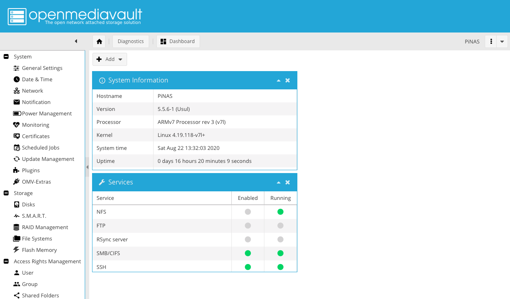
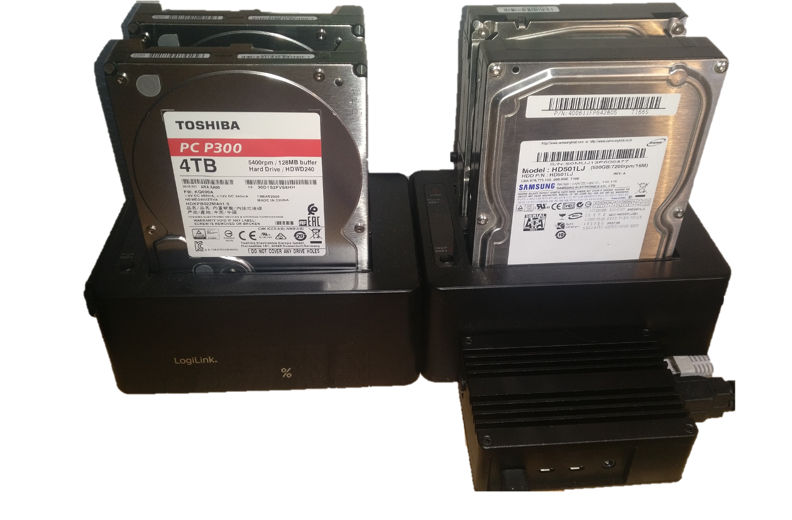
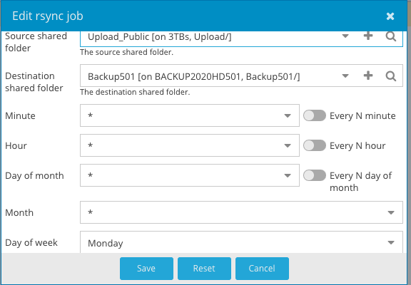

# PiNAS Setup
A cheap micro NAS using OpenMediaVault (OMV) and a Raspberry Pi 4 (2GB)



---

## Hardware



- LogiLink USB 3.0, 2-Bay Quickport/Dockingstation 
- Raspberry Pi 4 2GB
- Toshiba P300 4TB
- USB Typ C Power Supply
- Akasa Pi-4 
- Ethernet Cable CAT-5e (or better)
- Micro SD Card 32GB

## Info and Learnings

1. A raid setup is not supported for USB devices by OMV. (Rsync jobs are a working alternative)
2. Without the Akasa case, the ethernet performance is limited. (Every cooler which includes the USB-Controller solves the issue)
3. HDD spin down should be set to keep the drives silent.
4. More than 2GB Ram is not needed.
4. **A personal network storage can be very cheap if old drives are used.**

---

## OMV Setup

#### In Short
Prepare the Raspberry Pi
1. Download [Raspberry Pi OS (32-bit) Lite](https://www.raspberrypi.org/downloads/raspberry-pi-os/)
2. Put Pi OS on your SD Card (e.g. with [balenaEtcher](https://www.balena.io/etcher/))
3. Enabling SSH by creating a empty file with name ssh on the SD Card
4. Start the Pi with your SD card an run the OMV install script: 

    ```wget -O - https://github.com/OpenMediaVault-Plugin-Developers/installScript/raw/master/install | sudo bash```
5. Connect the hubs 
6. Insert the drives
7. Reboot/boot your Pi

#### A Detailed Guid is on Github
https://github.com/OpenMediaVault-Plugin-Developers/docs/blob/master/Adden-B-Installing_OMV5_on_an%20R-PI.pdf


### Network Access to the Drives
- The common protocol to access your NAS is **SMB/CIFS**.
- To create a share with the SMB protocol, you need to link a **Shared Folder**
- A shared folder requires a **File System** 
- And finally, the file system requires a **Disk**

Set up the:

1. Disks
2. File Systems
3. Shared Folders, and 
4. SMB/CIFS shares

After that, the **users** and **privileges of the shared folders** must be set.

### Backup and Redundancy
As RAID Management cannot be used with USB Hubs, Rsync must do the job of mirroring date between the drives. 




